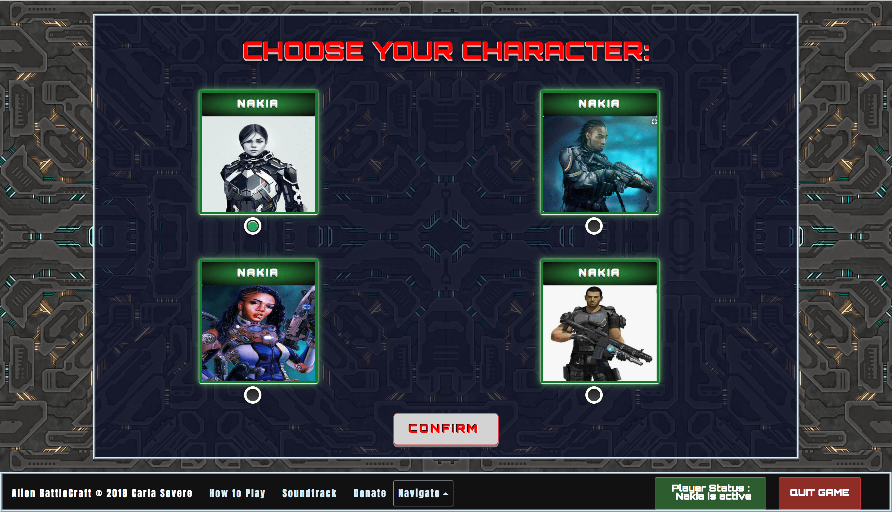
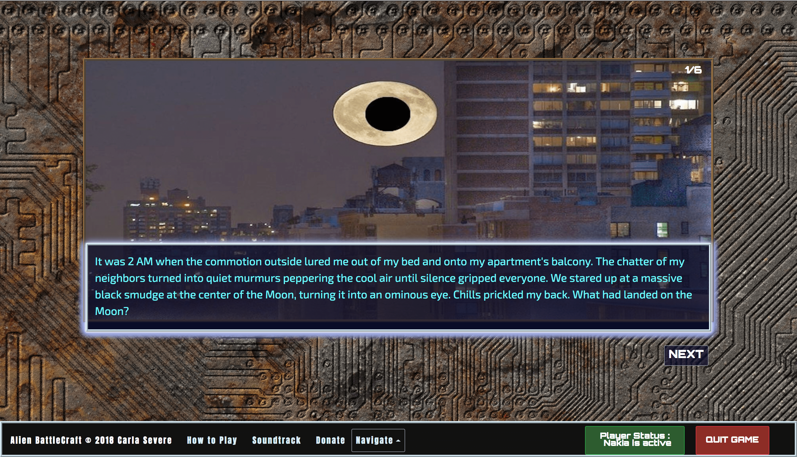
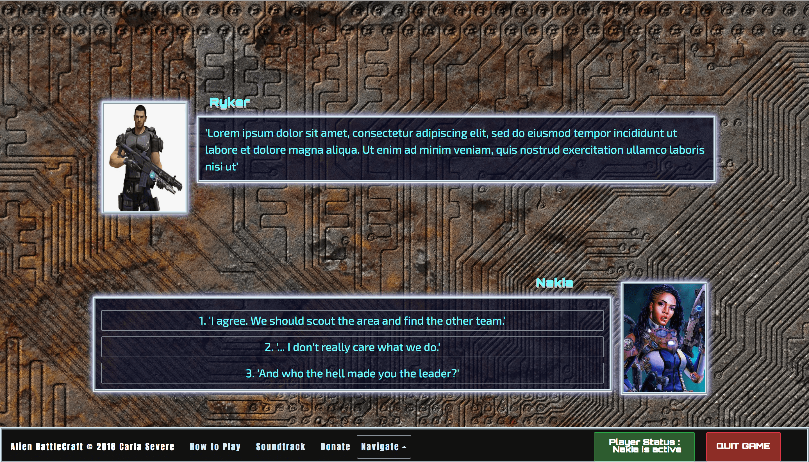
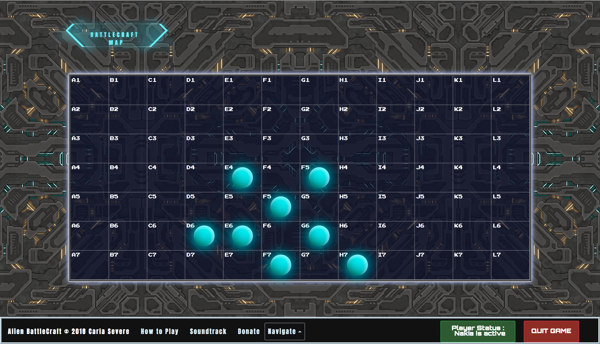
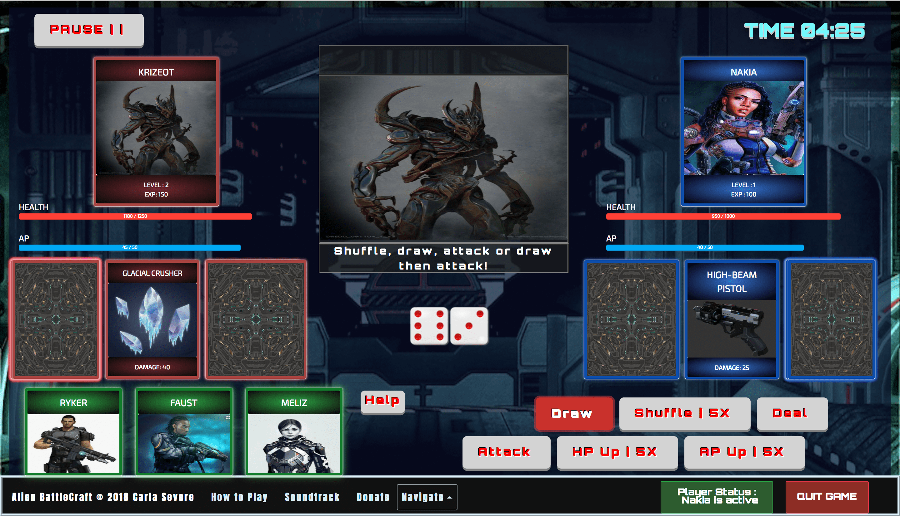

# ALIEN BATTLECRAFT

## About
Alien Battlecraft is a visual story game that takes place in a massive alien ship. Players team up with a crew to explore the battlecraft, fight off its hostile inhabitants, and uncover its multitude of secrets.

## The Tech 

React & Redux | JavaScript | Node.js| Express | MySQL | SASS | Bootstrap Beta 4  

## Challenges

- Authentication: Keeping the user logged in after page refreshes and handling log out

Okay, this one was super frustrating for some reason, but a series of troubleshooting got me the desired results. Also, one line saved my life: localStorage.setItem('token', response.data.token);

  

  

## Game Walkthrough

  

  

  

  

  

  

