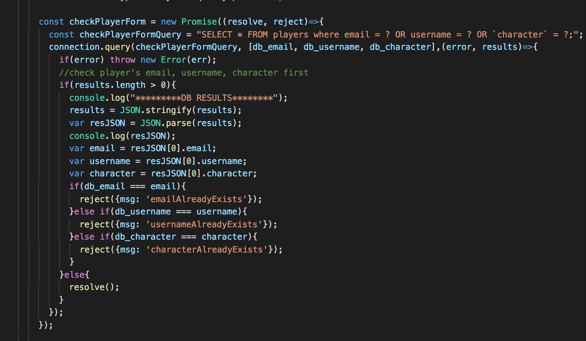
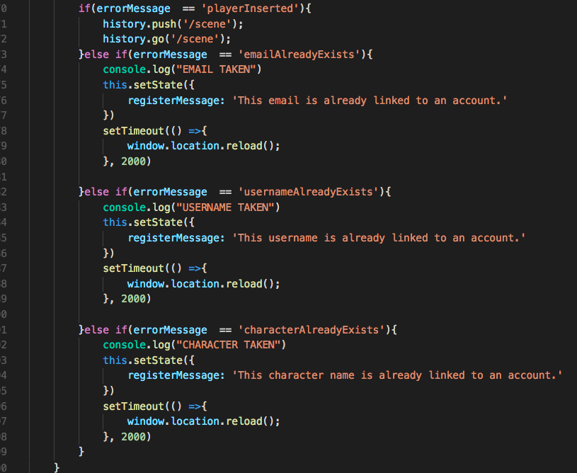
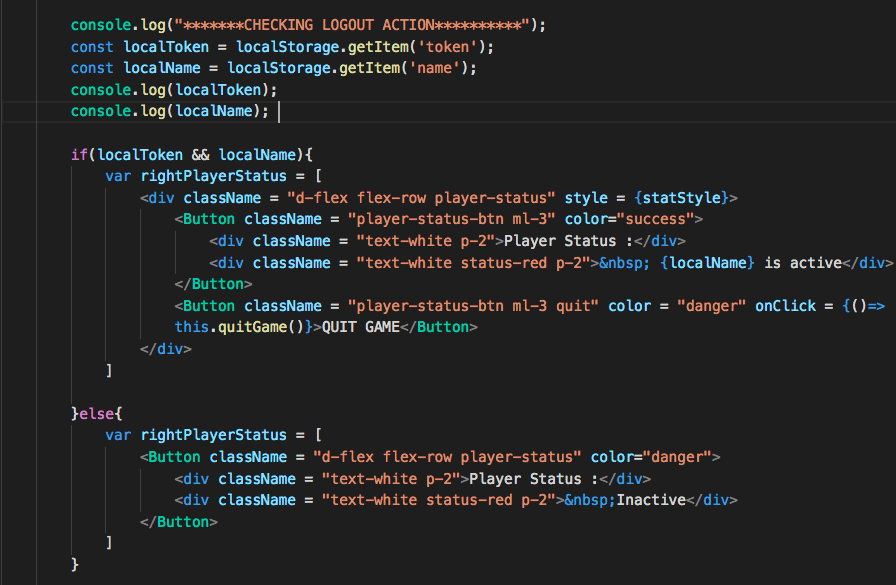

# ALIEN BATTLECRAFT

## About
Alien Battlecraft is a visual story game that takes place in a massive alien ship. Players team up with a crew to explore the battlecraft, fight off its hostile inhabitants, and uncover its multitude of secrets.

## Languages and Technologies

React & Redux | JavaScript | Express | MySQL | SASS | Bootstrap Beta 4  

## Challenges

- Checking database for duplicate emails, usernames, and character name when registering users

When creating the initial promise, I only checked the user's input email for a matching one in the database. I wrote a query that selected an existing email in the database and then checked whether my query produced results: if(results.length > 0){do stuff}. The problem was that I wanted to check for duplicates in usernames and character names too and produce unique error messages for each rejection case. I console.logged results and got an array of inaccessible data. How to get the specific values for email, username, and character in the results? I had to convert the results into a JSON string with JSON.stringify(), but I still couldn't get the values. That's where JSON.parse() came in to help. 

  

With that, the rest was history, and I simply compared the user input values against the values in the results to produce the appropriate error messages. Using redux and axios, I made an AJAX request to my server, grabbed the messages in the data in the response, sent it to my reducer to update the state,   and finally grabbed the data from the reducer to help create my backend validation for the login and register pages.

  

- Keeping the user logged in after page refreshes and handling log out

  

  

## Game Walkthrough

  

  

  

  

